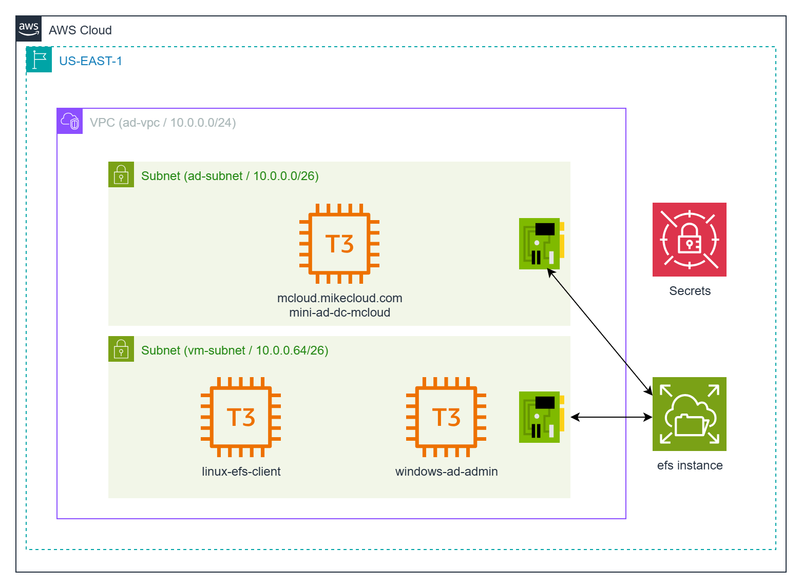
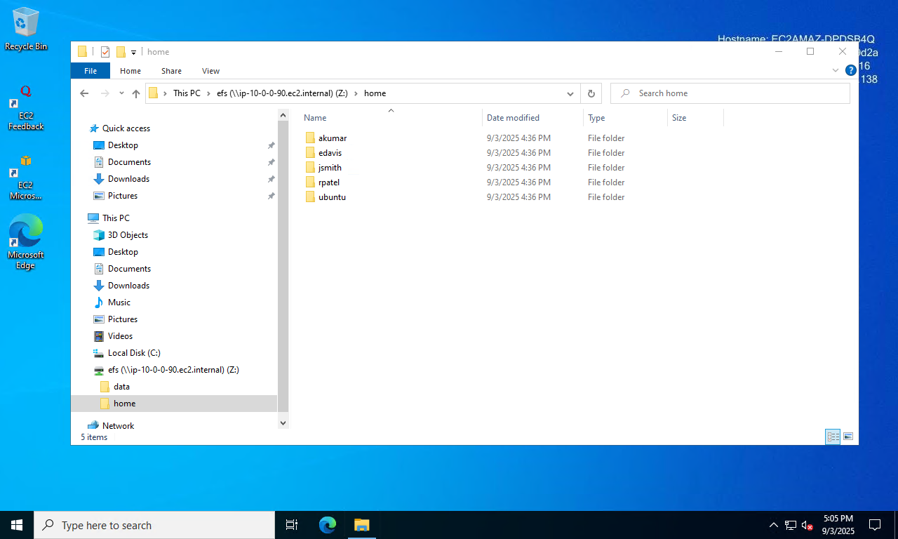

# AWS Mini Active Directory with EFS: NFS & Samba File Sharing

This project extends the original **AWS Mini Active Directory** lab by adding **Amazon Elastic File System (EFS)** as a shared storage backend. Instead of relying only on local disks or standalone file servers, this solution shows how to expose EFS storage in two ways:  

1. **Direct NFS Mounts on Linux Clients** – Linux machines joined to the mini-AD domain mount EFS directly for scalable, POSIX-compliant storage.  
2. **Samba File Server on Linux** – A Linux client mounts EFS locally and then exposes it via Samba, allowing Windows machines to access the same storage through familiar SMB shares.  

The mini-AD environment (Samba 4 on Ubuntu) provides Active Directory authentication and DNS services. EFS provides scalable, managed NFS storage. Together, they enable a hybrid setup where both Linux and Windows domain-joined clients can consume cloud-native storage seamlessly.  




## Understanding Amazon Elastic File System (EFS)

**Amazon Elastic File System (EFS)** is a fully managed, elastic, NFS-based file system designed to be shared across multiple Amazon EC2 instances and other AWS services. It provides a simple way to deliver shared storage that automatically grows and shrinks as files are added or removed, eliminating the need for capacity planning.

### When to Use EFS
EFS is a good fit for:
- **Shared File Storage** – When multiple Linux or Windows servers need to access the same dataset simultaneously.  
- **Lift-and-Shift Applications** – Legacy applications that expect a POSIX-compliant filesystem but need cloud scalability.  
- **Content Management & Web Serving** – Centralized storage for web content, media files, or shared project data.  
- **Big Data & Analytics** – Shared datasets for parallel processing across many compute nodes.  
- **Home Directories** – User home directories in multi-user environments, accessible from any server.  

### Key Benefits
- **Elastic & Pay-As-You-Go** – Storage scales automatically with usage.  
- **Multi-AZ Availability** – Data is redundantly stored across multiple Availability Zones.  
- **Managed Service** – No patching, backups, or infrastructure management required.  
- **High Throughput & IOPS** – Supports workloads that require parallel access to files.  

### Limitations of EFS

While powerful, EFS has some caveats:

- **Linux-Centric** – Native support is for NFS (Linux/Unix). Windows clients require Samba or an intermediate file server (as demonstrated in this project).  
- **Latency** – Network-based storage can introduce higher latency compared to local instance storage or EBS volumes.  
- **Throughput Modes** – Performance depends on selected mode (bursting, provisioned, or elastic), and heavy workloads may require tuning.  
- **Per-Instance Connection Scaling** – Each EC2 instance maintains a limited number of EFS client connections. Performance can degrade if too many processes or threads on a single node try to access EFS concurrently. Scaling out across multiple instances often delivers better results than scaling up one node.  
- **Cost** – Pay-per-GB pricing is higher than S3 or EBS in many cases; frequent access across AZs can add data transfer charges.  
- **No Built-in File-Level Features** – Missing features like Windows ACLs, quotas, or DFS namespaces (available in FSx for Windows File Server or FSx for NetApp ONTAP).  
.  

📌 **Tip:** Use **EFS** when you need scalable, shared storage that behaves like a standard filesystem. For Windows-native environments with advanced SMB features, consider **FSx for Windows File Server**. For enterprise NAS capabilities such as snapshots, cloning, and multiprotocol support, consider **FSx for NetApp ONTAP**.

## AWS Storage Cost Comparison (1 TB / month, us-east-1)

| Service        | Cost per GB-month | 1 TB Cost (approx) | Notes |
|----------------|------------------:|-------------------:|-------|
| **S3 Standard** | $0.023            | **$23.50**         | Cheapest, object storage, request + transfer fees apply |
| **EBS gp3**     | $0.080            | **$81.92**         | Block storage, single-instance use (can be Multi-Attach with limits) |
| **EFS Standard**| $0.300            | **$307.20**        | Shared NFS file system, elastic scaling across AZs |
| **EFS IA**      | $0.025            | **$25.60**         | Cheaper tier, but retrieval charges apply |


## Prerequisites

* [An AWS Account](https://aws.amazon.com/console/)
* [Install AWS CLI](https://docs.aws.amazon.com/cli/latest/userguide/getting-started-install.html) 
* [Install Latest Terraform](https://developer.hashicorp.com/terraform/install)

If this is your first time watching our content, we recommend starting with this video: [AWS + Terraform: Easy Setup](https://youtu.be/BCMQo0CB9wk). It provides a step-by-step guide to properly configure Terraform, Packer, and the AWS CLI.

---

## Download this Repository

```bash
git clone https://github.com/mamonaco1973/aws-efs.git
cd aws-efs
```

---

## Build the Code

Run [check_env](check_env.sh) to validate your environment, then run [apply](apply.sh) to provision the infrastructure.

```bash
develop-vm:~/aws-efs$ ./apply.sh
NOTE: Validating that required commands are found in your PATH.
NOTE: aws is found in the current PATH.
NOTE: terraform is found in the current PATH.
NOTE: All required commands are available.
NOTE: Checking AWS cli connection.
NOTE: Successfully logged into AWS.
Initializing the backend...
Initializing provider plugins...
- Reusing previous version of hashicorp/random from the dependency lock file
- Reusing previous version of hashicorp/aws from the dependency lock file
- Using previously-installed hashicorp/random v3.7.1
- Using previously-installed hashicorp/aws v5.89.0

Terraform has been successfully initialized!

You may now begin working with Terraform. Try running "terraform plan" to see
any changes that are required for your infrastructure. All Terraform commands
should now work.
```

---

### Build Results

When the deployment completes, the following resources are created:

- **Networking:**  
  - A VPC with public and private subnets  
  - Internet Gateway and NAT Gateway for controlled outbound access  
  - Route tables configured for both public and private subnets  

- **Security & IAM:**  
  - Security groups for the domain controller, Linux client, Windows client, and EFS mount targets  
  - IAM roles and policies allowing EC2 instances to use AWS Systems Manager and mount EFS  
  - Secrets stored in AWS Secrets Manager for AD administrator and test user credentials  

- **Active Directory Server:**  
  - Ubuntu EC2 instance running Samba 4 as a Domain Controller and DNS server  
  - Configured Kerberos realm and NetBIOS name  
  - Administrator credentials managed in AWS Secrets Manager  

- **Amazon EFS:**  
  - Elastic File System provisioned with mount targets in each private subnet  
  - Security group allowing NFS traffic (TCP/2049) from Linux and Windows servers  
  - Configured for multi-AZ availability and automatic scaling  

- **Linux Client Instance:**  
  - Domain-joined Ubuntu EC2 instance with SSSD integration  
  - Mounts EFS directly via NFS for testing POSIX file access  
  - Configured to expose the EFS mount as a **Samba share**, enabling Windows clients to access it  

- **Windows Client Instance:**  
  - Domain-joined Windows Server EC2 instance  
  - Can access EFS storage via the Samba share hosted on the Linux client  
  - Supports domain-authenticated users for SMB access  


---

### Users and Groups

As part of this project, when the domain controller is provisioned, a set of sample **users** and **groups** are automatically created through Terraform-provisioned scripts running on the mini-ad server. These resources are intended for **testing and demonstration purposes**, showcasing how to automate user and group provisioning in a self-managed Active Directory environment.


#### Groups Created

| Group Name    | Group Category | Group Scope | gidNumber |
|---------------|----------------|-------------|-----------|
| mcloud-users  | Security       | Universal   | 10001     |
| india         | Security       | Universal   | 10002     |
| us            | Security       | Universal   | 10003     |
| linux-admins  | Security       | Universal   | 10004     |

#### Users Created and Group Memberships

| Username | Full Name   | uidNumber | gidNumber | Groups Joined                    |
|----------|-------------|-----------|-----------|-----------------------------------|
| jsmith   | John Smith  | 10001     | 10001     | mcloud-users, us, linux-admins    |
| edavis   | Emily Davis | 10002     | 10001     | mcloud-users, us                  |
| rpatel   | Raj Patel   | 10003     | 10001     | mcloud-users, india, linux-admins |
| akumar   | Amit Kumar  | 10004     | 10001     | mcloud-users, india               |

---

#### Understanding `uidNumber` and `gidNumber` for Linux Integration

The **`uidNumber`** (User ID) and **`gidNumber`** (Group ID) attributes are critical when integrating **Active Directory** with **Linux systems**, particularly in environments where **SSSD** ([System Security Services Daemon](https://sssd.io/)) or similar services are used for identity management. These attributes allow Linux hosts to recognize and map Active Directory users and groups into the **POSIX** (Portable Operating System Interface) user and group model.

---

### Log into Windows Instance  

When the Windows instance boots, the [userdata script](02-servers/scripts/userdata.ps1) executes the following tasks:  

- Install Active Directory Administrative Tools  
- Install AWS CLI  
- Join EC2 instance to Active Directory  
- Grant RDP access to domain users  
- Perform a final system reboot  

Administrator credentials are stored in the `admin_ad_credentials` secret.



---

### Log into Linux Instance  

When the Linux instance boots, the [userdata script](02-servers/scripts/userdata.sh) runs the following tasks:  

- Update OS and install required packages  
- Install AWS CLI  
- Join the Active Directory domain with SSSD  
- Enable password authentication for AD users  
- Configure SSSD for AD integration  
- Grant sudo privileges to the `linux-admins` group  
- Sets up Samba and shares `/efs` for Windows access to EFS

Linux user credentials are stored as secrets.


---

### Clean Up Infrastructure  

When you are finished testing, you can remove all provisioned resources with:  

```bash
./destroy.sh
```

This will use Terraform to delete the VPC, EC2 instances, IAM roles, security groups, and any other infrastructure created by the project. Secrets stored in AWS Secrets Manager will also be deleted unless retention policies are configured.
